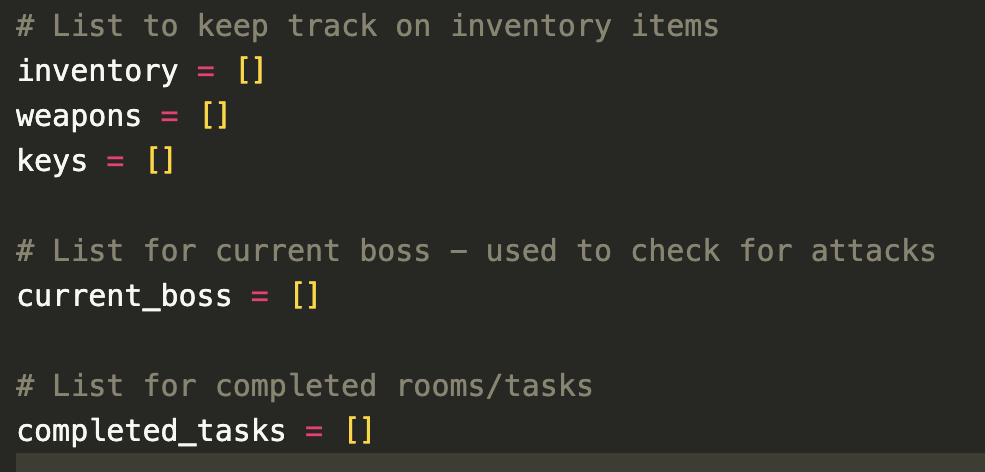
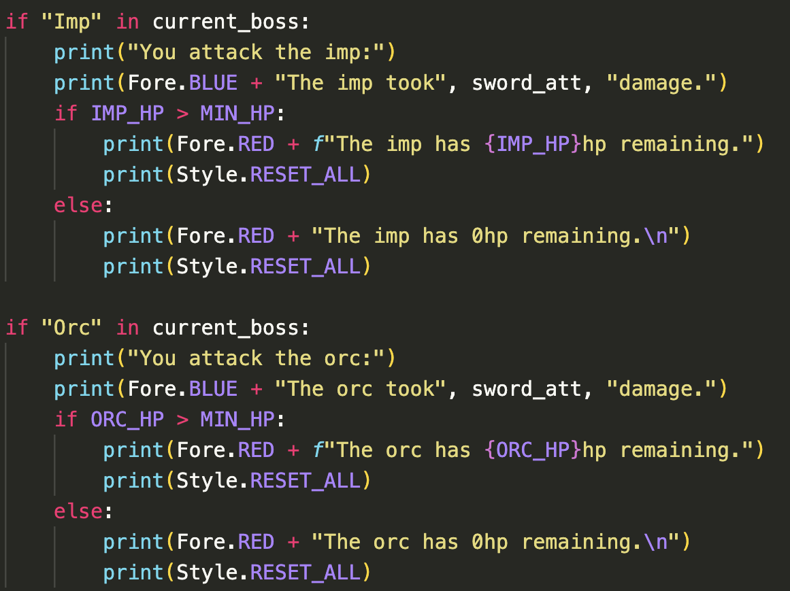

# **Escape the Dungeon**

### NOT CURRENTLY LIVE - TO VIEW SAVE SOURCE CODE

# **Introduction**
Escape the Dungeon is a text-based adventure game where the player has to try and escape the dungeon. 

There are several different rooms that the player must go through and complete before getting to the boss room to defeat the final boss.

The game is purely terminal based, however in the future, I would like to add animation and sound features to the game.

In this document I will discuss some of my comments about the game as well as where I got my inspirations from to create a text-based game, as well as some thoughts I had on using Python for the first time. I will also discuss the creation of the map and function breakdown, using LucidChart.

Furthermore, I will go into the features and gameplay aspects of the game, as well as features that I intend to implement in the future. 

I will finally go through the testing I done for the game, as well as the method I had used to deploy the game so that it was live.

## **Table of Contents**

<a href="#creators-comments">Creators Comments</a>

<ul>
<li>Reason Behind the Game</li>
<li>Inspirations</li>
<li>My Thoughts</li>
</ul>

<a href="#lucid-chart">Lucid Chart</a>

<ul>
<li>Map</li>
<li>Functions</li>
</ul>

<a href="#features-and-gameplay">Features and Gameplay</a>

<ul>
<li>Introduction</li>
<li>Input and Functions</li>
<li>Rooms</li>
<li>Weapons</li>
<li>Items</li>
<li>Traps and Puzzles</li>
<li>NPC and Boss Fights</li>
<li>Stats and Inventory</li>
<li>Lists</li>
</ul>

<a href="#features-to-add">Features to Add</a>

<ul>
<li>Stat Bar</li>
<li>Animation and Sound</li>
<li>Map Display</li>
<li>Further In-game Aspects</li> 
<li>Updated Input</li>
</ul>

<a href="#testing">Testing</a>

<ul>
<li>Built-in Linter</li>
<li>Player testing</li>
<li>Unfixed Bugs</li>
</ul>

<a href="#deployment">Deployment</a>

<ul>
<li>Heroku</li>
</ul>

<a href="#credits">Credits</a>

<ul>
<li>Content</li>
</ul>

 

## **Creators Comments**
Within this section I will go into detail about my reasons why I decided to create a text-based adventure game, where I got my inspirations from and my thoughts on using Python. Throughout the game there are some colour changes, which were made using the Colorama module installed into Python.
### ***Reasons Behind the Game***
I have always been a bit of a gamer and enjoyed playing different types of games. Even when I was younger I remember playing several text-based games that I owned or that were online. It was definetly a nostalgic past time and I wanted to recreate some of that with this game. 

Playing these adventure games always made me happy and it was always interesting to know the different ending possibilities to get. Although I decided to opt for a more simple version of a text-based adventure game, there are more interactions that would have been interesting to add or create - however I decided to get the main part of the game completed before thinking about anything else more complex.

Before I started writing the code for the game, I planned out document of what I possibly wanted to add in, so I knew what I was going to do. The document served as my basis to start creating the text-based game. I did refer to this document a lot throughout the game when adding 'player', 'enemy', 'health/stamina', and 'damage' stats. I did change some of the ideas when actually implementing the game, however the basis all stayed the same.

### ***Inspirations***
A lot of my insirations came from games I have played as a child and growing up. I played a lot of different types of games and different genres - I especially emjoyed playing RPG games though. 

Some games that I took inspiration from:
* Legend of Zelda Series
* Elden Ring
* Hugo's House of Horrors (and the rest of the series)
* The Lifeline series (mobile game)
* Dungeons and Dragons

### ***My thoughts***
Using Python and a text-based terminal was a really fun experience. The text-based terminal really did remind me of vintage and retro games that I used to play online. Python was also a fun language to use to create the code and easy to understand, without having run into many problems and issues. All in all I am happy with what I have created and I have had fun playing it as well as creating it.

## **Lucid Chart**
To help create a flow-chart for the map and the functions for the game, so that I can have a visual aspect of what I need to do, as well as how the functions flow, I used a free application called [LucidChart](https://lucid.app/documents#/dashboard). It was a very helpful tool to create and breakdown what I needed to do after creating my inital word document.

### ***Map***
Creating a visable map made it easier when creating functions and testing to navigate through the game, however for gameplay purposes the map wont be avaliable for users.

* 12 rooms in total with different paths 
* Some rooms have pickup items, that won't respawn
* There are some traps/puzzles in some rooms
* Green circle symbolises player start, yellow star is a secret room, red star is end of the game
* There is an NPC avaliable in one of the rooms

### ***Functions***
* By creating a flow-chart for the functions to breakdown what the user will select and what I want the user to do, as well as the outcome helped to create the actual Python functions when making the game. 
* It helped me to create the necessary functions needed without having to spend ages thinking about them, however there was changes made during the development process. 
* This was because I decided I wanted things to run differently, or just to expand on the functions a little more. 
* The function flow-chart broke down my thought process a little more on what I actually wanted to do.
* This will be discussed in further detail in the <a href="#input-and-functions">Input and Functions</a> section.

## **Features and Gameplay**
In this section I will discuss several of the features that I had implented into my game.
### ***Introduction***
* The game starts with a small introduction about the game, displaying the rules for the game, as well as how to navigate through the game.
* It also gives users the goal of the game, as well some some hints of what is required to beat the game.
* It finally asks whether the user would like to play, using the 'input' feature, allowing users to either type 'y' or 'yes' to continue, the game will end if anything else has been typed in, this was an intentional feature I added - if the user decides not the play, a message will print on the screen letting users know the game is being exited.

* If the player decides to play the game it will take them to a new screen that is automatically cleared, with a 'clear' function that has been implemented throughout the game (this will be discussed more in the <a href="#input-and-functions">Input and Functions</a> section below) asking players for their name - this can be left blank if players do not want to input anything.
* After the player name has been typed, a welcome message will appear using the players name, and welcoming them into the start of the game.

### ***Input and Functions***
#### Input
* Escape the Dungeon uses a lot of 'input' methods for the main features of the game to work, as it is based on player choice. 
* The main 'input' features for the game will not allow a user to proceed without typing something into the terminal - the only input features this does not apply to is the 'Clear Terminal' function, asking the player whether they would like to play, and inputting players name. 
* All other 'input' will require the user to put one of the required letters into the terminal - letters were used rather than words to make it easier for the player to navigate through the game.

* There are different 'input' choices depending on what the user needs to do, such as 'fight', 'take item', 'choose weapon', 'choose direction', 'speak to NPC', 'escape trap', and 'use item'.

* All answers for the 'input' will automatically be changed to lowercase letters, even if the user types in capital letters throughout the game - white spaces will also be stripped - this changes when users input their name as it will capitalise the first letter of the name.

#### Functions
* There are several functions for the game, each one serving a different purpose.
* When enterting each room the player will be asked whether they want to clear the terminal, this is just to clean up space so that it is not getting too busy - the 'clear' function was created using a module that was imported into Python known as the 'os' module.
* Each room (except 'room 5') players will be asked whether they want to view their 'stats' and 'inventory', so that players can keep track of these throughout the game.
* The main gameplay functions include: rooms, attack, checking stats, collecting items, using items, and puzzles/traps.

* There are functions that are room specific, that can only be triggered with certain events - such as having a 'key', 'potion' or certain 'weapon'.

* Each function will lead to something else occuring, whether it is another function, or an 'input' choice for the player to make - and once certain choices are made, it will add things to a hidden list known as 'completed_tasks', so that certain functions will run differently.

* Throughout each of the function several 'if/else' or 'if/elif/else' statements were used in order to create game functionality so players can choose an option and there be something to happen for each option chosen.
* 'While loops' were also used when doing user 'input' to ensure that players were entering an answer into the terminal for what to do next.
* 'While loops' and 'if/else' statements were also used for the battle function in the game so that the fight can progess - more about the fight mechanic will be discussed in the <a href="#npc-and-boss-fight">NPC and Boss Fight</a> section.

### ***Rooms***
* There are 12 rooms in total for the dungeon game, each room except the 'starting room' and 'room 5' have something unique about them.
* Each room contains various 'if/elif/else' statements and 'while loops' for functionality to make the choices in the game work, as well as to ensure players cannot pick up items twice.
* The 'starting room' is the first room the players will find themselves in when they begin the game, and will be presented with a choice of going 3 different directions from there, which the player will have to enter into the terminal, each choice leading to a different room. 
* 'Room one' is the room that holds 'key 1' and the first weapon choice the player must make, once the weapon has been chosen, it will trigger a fire trap that the players have a choice to either 'disarm' or 'jump' through, either choice will lead the player back to the 'starting room' however damage will be taken depending on which option was chosen - when returning to the room after collecting everything it will be empty and the fire trap won't respawn.

* 'Room two' will take players to a lake puzzle in the game, where players can choose to either 'swim' through or 'jump' across the lake to get to the other side (...because dungeons can have all sorts of vegetation, Zelda is a great example for this). Once players reach the other side there is a 'potion' that can only be taken once (if there isn't one already in the inventory from a different area). Players will need to go through the lake each time they go through this room.

* 'Room three' will be the first 'mini boss' room, which requires the key, collected from 'room one' to enter. Players can choose to fight the 'mini boss' or run away, upon defeating the 'mini boss' it will remain defeated and will not respawn so players can go back to the room without initiating the fight again.
* 'Room four' has 'key 2' which will be required to get into a different area of the dungeon. There will also be an NPC fairy that players can choose to speak to here, that will respawn each time the player enters the room.
* 'Room five' is an empty room that players pass through during the game that has nothing important in it.
* 'Room six' has another puzzle that players must get through, either going through the mystical vines that regrow once cutting through them, however this option requires the player to have the sword, otherwise they are sent to the tunnel, which has a 'jump' or 'duck' event that players must decide the correct choice - either path will lead towards the next room. Once at the other end of the puzzle there will be another 'potion' that users can collect if there isn't one in their inventories already, this will not respawn if players have already collected this one. Players will need to go through this puzzle each time they enter this room.
* 'Room seven' is the second 'mini boss' fight which requires the key, collected from 'room four' to enter. Players can choose to fight the 'mini boss' or run away, upon defeating the 'mini boss' it will remain defeated and will not respawn so players can go back to the room without initiating the fight again. This room also contains a secret item that players can only collect when the 'mini boss' has been defeated - it will not respawn once it has been collected or used.

* 'Room eight' has a 'secret room key' that opens up a secret room that players will need to enter for upgraded items.
* 'Room nine' has the 'boss key' and the final 'potion' that can be collected - both items can only be collected if they are not in the inventory already, and will not respawn once collected.
* 'Secret room' is a room off 'room three' that can only be entered once you have the 'secret key', this is where players can choose to get the upgraded version of a weapon as well as choose to use a different weapon if they want. The player will also be able to take the armour if they have the secret item in their inventory, once this secret item has been used and the armour is unlocked and taken it will reveal a secret passage that users can take which will take them to 'room 8'. The secret passage allows users to get to the 'boss room' quickly, rather than going all the way around, however they can still choose to go around if they prefer. Players can enter this room without the secret item, but they will only be able to choose a weapon and not take the 'armour'.
* 'Boss room' is the final room players will come too and will need to defeat the 'master boss' to win and escape the game - it is recommended to have the armour, however once entering the room there is no escape...so players will need to think about having the armour beforehand.

### ***Weapons***
* There are 4 weapons in the game in total but there are only 2 types - a 'sword' or a 'bow and arrow'.
* Players will have to choose which starting weapon they want in 'room one' - they will be presented with a choice, and once they have chosen the inital weapon they cannot change it until they get to the 'secret room' where they can choose the master versions of the 'sword' or 'bow and arrow'.

* Each weapon has a specfic amount of damage that it deals, and this is more when using the master version of the weapons - this is a pretty typical mechanism of the majority of RPG games.
* Each weapon has a random range for damage attacks, as this is also a typical feature of RPG games.

* Players are given a choice as it allows them to be able to roleplay some more on what kind of character they want - when I play these sorts of games, I however do use both types of weapons, however that mechanism is not on the game yet.
* The starter weapons are strong enough to defeat the 'mini bosses' however they will need the master weapons to defeat the 'master boss' - as the name intends.

### ***Items***
* Throughout the game there are 4 keys. 3 potions, 1 secret item and a piece of armour that can be collected.
* The keys are required to open certain rooms and progress throughout the game, players won't be able to get to certain areas without them and will not be able to complete the game - keys will not respawn.
* Keys can be found in: 'room one', 'room four', 'room eight' and 'room nine'.
* Potions will heal the players health back to full health and are used before fighting a boss, they are not respawned once they are picked up, and only one can be in the inventory at once.
* Potions can be found in: 'room two', 'room six' and 'room 9' - each room is before a boss fight (as this is something I have noticed in a lot of RPG games, as a warning to let players know that they may need the item).
* The secret item is a 'stone' that can only be collected once the 'mini boss' is defeated in 'room seven' and this grants the player access to the 'armour' that is found in the 'secret room'.
* The 'armour' is an item that increases the players health for when they fight the 'master boss', although they can try to fight the 'master boss' without it, they won't get very far.
* Taking the 'armour' will trigger an event allowing users a quick way through to 'room eight'.

### ***Traps and Puzzles***
* There are a few traps and puzzles throughout the game, which is something that is also typical of most RPG games. 
* There is a 'fire' trap in 'room one' when players take their weapon, and players must choose what to do, either to 'disarm' the trap or 'jump' through it - each option will lead to some damage but one option is the correct choice compared to the other. This trap however will not respawn when players return as it is only triggered when they choose a weapon.

* 'Room two' has a lake puzzle that players must either 'swim' through or 'jump' across, each will also lead to some damage but one choice is less significant than the other. Players will have to go through this each time they enter this room.

* 'Room six' has the jungle puzzle where players can either go through the 'vines' but this requries them to have the sword, or 'through' the tunnel, which players will be sent to if they try to go through the vines without a sword. When entering the tunnel players will have to deal with another puzzle where they can either 'duck' or 'jump', each choice leading to damage, however one more significant than the other. These puzzles will always be there when players enter the room.

### ***NPC and Boss Fights***
* Throughout the game there is 1 NPC, 2 mini bosses and 1 master boss that players will interact with, this is something that will occur in a lot of RPG games.
* When fighting enemies the 'current boss' will be appended to a list so that the function can be played out, this is so that the correct boss fight text is being displayed.
* There is an NPC 'fairy' in 'room four' that players can choose to speak to, she will reappaer each time players enter the room. Upon speaking to her, players can choose to get more information from her that can be helpful for game progression, this is however the players choice and is not required.
* The conversation with the NPC has been changed to a different colour using Colorama to show that it is a conversation occuring.

* Players will also come across two types of mini bosses, one in 'room three' which will be an 'imp' and one in 'room seven' which is an 'orc' - both of these bosses can be deafted easily with the starter weapons and ensuring the player has enough HP.
* Each mini boss has their own set of stats and damage attacks, the 'imp' has lower stats as it is an easier mini boss to defeat, the 'orc' has slightly higher stats - the damage stats are also set to a random integer.
* When players choose to fight the mini bosses, the fight functions will load on their own and take turns as they are placed in a 'while loop', so until either the player or mini boss dies, it will continue.

* The master boss will also have it's own set of damage it inflicts on the player per attack (these damage stats are set to a random integer), and the master boss also has the highest HP out of all the bosses, as it is the largest, being a 'dragon' and all.
* Players will need a master weapon to defeat the dragon, and having the 'armour' will increas the players HP which will help to defeat the 'dragon', however players can fight the dragon without it.
* Once the 'dragon' has been defeated the player has escaped and won the game.

### ***Stats and Inventory***
* The player has set health and stamina throughout the game, the health will decrease with damage and can only be increased when using a potion, however the stamina regenerates in its own (which is pretty typical in RPG games). 
* Both health and stamina were added as this is something a lot of games have, as certain actions will involve using stamina to do.
* Players health wont be able to go above the max health set, however once the player has aquired the armour, their health will increase to a higher maximum.
* Players lose health either through puzzles, traps and fighting enemies.
* When damage is taken the health stat is stored as a 'global' feature to ensure that it doesn't revert back to the original stat when changing to a different room and remains the damaged one.

* Players will be asked in each room whether they want to view their 'stats' and 'inventory', so they can keep track of these throughout the game.
* The players stats will change once the 'armour' is in the inventory.
* Any item collected in the game will go into one of the inventory categories: 'weapons', 'keys', 'inventory' - once an consumable item has been used, such as a 'potion' it will be removed from the inventory.

### ***Lists***
* There are 5 empty lists at the start of the game, that will be 'appended' throughout the gameplay - once a consumable has been used, it will be removed from the list.
* Once the player chooses a master weapon, the original weapon will also be removed.
* The player is only able to view the 3 inventory lists: 'weapons', 'keys', 'inventory'.
* The other 2 lists are: 'completed tasks' and 'current boss' - these are both a hidden gameplay mechanic.
* The 'completed tasks' list keeps track of rooms that have been completed so that certain events and items do not respawn or get triggered again, while the 'current boss' list is used to keep track of the current boss, this is only used during the boss fights to determine which boss is currently being fought so that the correct text can be displayed.

## **Features to Add**
In this section I will talk about some features I would like to implement in the future for the game. Some of these features were not implemented due to time constraints, as well as not being fully confident on how to display these in the terminal for the game - however this will be a future goal to try and improve on. Some of these ideas also came to me when I had already started the game and have created a good portion of the code. It would be really fun to create a more RPG style game similar to ones I played growing up...and still play now.
### ***Stat Bar***
* Having a stat bar displayed throughout the game, rather than asking the user whether they want to view their stats each time.
* The stat bar will increase and decrease with damage and interactions - similar to RPG games.
* This would also be displayed on the UI on an animated version of the game.
### ***Animation and Sound***
* An option to ask players whether they want to play the terminal based game or the animated version.
* Rather than having a terminal based game, turn it more into an RPG style game where players can use their keyboard to move around.
* There will still be prompts asking players if they want to use/take item throughout the game, however it will be more keyboard direction based rather than typing in answers
* Adding some sounds to go with the animation aspects of the game, however sounds can also be adding without the animation and keep it as a terminal based game.
### ***Map Display***
* A map display for the animated version of the game on the UI so that users can see where they are going - very similar to the map displays in various RPG games.
* Map display for the terminal based game, that players can choose to view if they need help.
### ***Further In-game Aspects***
* Some further aspects to turn the game into a more RPG style would be having a character selection feature, where the player can choose what kind of character they would like, and each character would have various stats depending on which one they choose.
* Further rooms and secrets for players to interact with - such as more storylines like how they ended up in the dungeon to begin with, and what happened after the dungeon.
### ***Updated Input***
* Rather than players typing 1 letter for an action, I would want to update it so that they would need to type the full action, e.g. 'Go north', 'Pick up potion' - the reason this was not added in was to make it easier for the user to progress throughout the dungeon in the first stages of the game.

## **Testing**
Thoughout creating the game, I would test each room and function and ensure that it was all working correctly and as needed. When I did run into problems I changed the code and retested a few times to ensure that it was working as needed. Because of the testing I noticed that items could be picked up more than once when used, hence why I decided to create the 'completed tasks' list to ensure that items were not being picked up twice.

I was using the built-in linter for the project on 'Code Anywhere' which told me of any issues and problems within my code, as well as when I would run the code, the terminal would pop up with any issues that I would need to fix in order for the code to function properly and as intended.
### ***Built-in Linter***
* When using the built-in linter throughout the project there were a few fixes I had to go back to and fix a few times,but it was definetly a useful tool to have and to use to see what problems there were - as well as the terminal letting me know of any issues with the code.
* The final code does not have any warnings with the built in linter in the terminal and it all runs correctly when testing out in the terminal, checking several variations of going through the dungeon.

### ***Unfixed Bugs***
* The only unfixed issue is the warning that came up in the linter of the code character lines being too long, however this causes no actual issue within the game itself.
* I could not find any other bugs itself.

## **Deployment**
In this section I will go through how I deployed my project live to the web using [Heroku](https://id.heroku.com/login) as a hosting platform for the application. I used Github to store my project, however it was deployed using Heroku.
### ***Heroku***
* The first thing I needed to do was to ensure that my requirements file was updated with any imports that I am using that will be required to show in the terminal on the platform. To do this I had to go to the terminal and type: 'Pip3 freeze > requirements.txt' and this updated the requirements text document, after I needed to ensure this was pushed to Github.

* After creating an account on Heroku, I needed to create an app, so I went to the create app button, which took me to a 'Create new app' screen. From here I had to name my application - note that all applications must be unique. I then selected my region, and since I live in the UK, I selected 'Europe'
* After I filled that in I clicked on 'Create app'.

* Once the app has been created, it takes me to the 'Deploy' page, before I filled this part in, I went over to the settings tab, and from there I needed to add 'config vars', to do this I clicked on 'reveal config vars' and filled it in with the necessary information, which for my project was: 'Key = PORT' and 'Value = 8000'. Then I added this - this was the only one I needed to add for my project.

* After adding the 'config vars' I needed to add the necessary 'buildpacks' for my game, to do this I went to the option below the 'config vars' and clicked on 'add buildpack'. I then selected the 2 necessary ones needed for the project, which were 'python' and 'nodejs' (these need to be added one at a time) - and then I ensured they were displayed in the correct order, 'python' being first then 'nodejs' being second in the list.

* After this I went to the 'Deploy' tab and connected my Heroku to my Github account so I can access my repositories.
* I then searched for the correct repository and linked them together so that Heroku can access it and I can get it ready to deploy.

* Finally I first went to manually deploy my project so I can see it being built, but once it was done I changed it to automatic deployment so that whenever I push the project it will automatically build and update.

* The Heroku link: [Escape the Dungeon](https://escape-the-dungeon-am.herokuapp.com/)
* Github repository: [Escape the Dungeon](https://github.com/annacakes281/escape-the-dungeon)
## **Credits**
To create the project I used the template provided by the [Code Institute](https://github.com/Code-Institute-Org/p3-template).
### ***Content***

* For ideas on creating the map as well as using the clear functions, I followed along with the video by Dante Lee:
    * [Video](https://www.youtube.com/watch?v=lI6S2-icPHE&t=19s)
    * [Source Code](https://github.com/dante0527/TextBasedGame)

* To help create the boss attack functions, I used the help of a Youtube video by Andrew Howard:
    * [Video](https://www.youtube.com/watch?v=Mq_bN1kZ71U&list=PLES3Y8j562C2ncjly27QLCz3TWuFlzKVq&index=6)

* To add colour to the text I used [Colorama](https://linuxhint.com/colorama-python/) 
* I asked for help on slack with some code and a student helped me with it, so I would like to thak them for the help!

