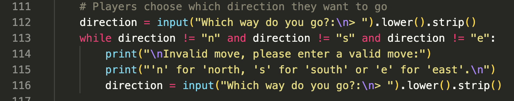

# **Escape the Dungeon**

# **Introduction**
Escape the Dungeon is a text-based adventure game where the player has to try and escape the dungeon. 

There are several different rooms that the player must go through and complete before getting to the boss room to defeat the final boss.

The game is purely terminal based, however in the future, I would like to add animation and sound features to the game.

In this document I will discuss some of my comments about the game as well as where I got my inspirations from to create a text-based game, as well as some thoughts I had on using Python for the first time. I will also discuss the creation of the map and function breakdown, using LucidChart.

Furthermore, I will go into the features and gameplay aspects of the game, as well as features that I intend to implement in the future. 

I will finally go through the testing I done for the game, as well as the method I had used to deploy the game so that it was live.

## **Table of Contents**

<a href="#creators-comments">Creators Comments</a>

<ul>
<li>Reason Behind the Game</li>
<li>Inspirations</li>
<li>My Thoughts</li>
</ul>

<a href="#lucid-chart">Lucid Chart</a>

<ul>
<li>Map</li>
<li>Functions</li>
</ul>

<a href="#features-and-gameplay">Features and Gameplay</a>

<ul>
<li>Introduction</li>
<li>Input and Functions</li>
<li>Rooms</li>
<li>Weapons</li>
<li>Items</li>
<li>Traps and Puzzles</li>
<li>NPC and Boss Fights</li>
<li>Stats</li>
<li>Inventory</li>
</ul>

<a href="#features-to-add">Features to Add</a>

<ul>
<li>Stat Bar</li>
<li>Animation and Sound</li>
<li>Map Display</li>
<li>Further In-game Aspects</li> 
<li>Updated Input</li>
</ul>

<a href="#testing">Testing</a>

<ul>
<li>Built-in Linter</li>
<li>Player testing</li>
<li>Unfixed Bugs</li>
</ul>

<a href="#deployment">Deployment</a>

<ul>
<li>Heroku</li>
</ul>

<a href="#credits">Credits</a>

<ul>
<li>Content</li>
</ul>

 

## **Creators Comments**
Within this section I will go into detail about my reasons why I decided to create a text-based adventure game, where I got my inspirations from and my thoughts on using Python.
### ***Reasons Behind the Game***
I have always been a bit of a gamer and enjoyed playing different types of games. Even when I was younger I remember playing several text-based games that I owned or that were online. It was definetly a nostalgic past time and I wanted to recreate some of that with this game. 

Playing these adventure games always made me happy and it was always interesting to know the different ending possibilities to get. Although I decided to opt for a more simple version of a text-based adventure game, there are more interactions that would have been interesting to add or create - however I decided to get the main part of the game completed before thinking about anything else more complex.

Before I started writing the code for the game, I planned out document of what I possibly wanted to add in, so I knew what I was going to do. The document served as my basis to start creating the text-based game. I did refer to this document a lot throughout the game when adding 'player', 'enemy', 'health/stamina', and 'damage' stats. I did change some of the ideas when actually implementing the game, however the basis all stayed the same.

### ***Inspirations***
A lot of my insirations came from games I have played as a child and growing up. I played a lot of different types of games and different genres - I especially emjoyed playing RPG games though. 

Some games that I took inspiration from:
* Legend of Zelda Series
* Elden Ring
* Hugo's House of Horrors (and the rest of the series)
* The Lifeline series (mobile game)
* Dungeons and Dragons

### ***My thoughts***
Using Python and a text-based terminal was a really fun experience. The text-based terminal really did remind me of vintage and retro games that I used to play online. Python was also a fun language to use to create the code and easy to understand, without having run into many problems and issues. All in all I am happy with what I have created and I have had fun playing it as well as creating it.

## **Lucid Chart**
To help create a flow-chart for the map and the functions for the game, so that I can have a visual aspect of what I need to do, as well as how the functions flow, I used a free application called [LucidChart](https://lucid.app/documents#/dashboard). It was a very helpful tool to create and breakdown what I needed to do after creating my inital word document.

### ***Map***
Creating a visable map made it easier when creating functions and testing to navigate through the game, however for gameplay purposes the map wont be avaliable for users.

* 12 rooms in total with different paths 
* Some rooms have pickup items, that won't respawn
* There are some traps/puzzles in some rooms
* Green circle symbolises player start, yellow star is a secret room, red star is end of the game
* There is an NPC avaliable in one of the rooms

### ***Functions***
* By creating a flow-chart for the functions to breakdown what the user will select and what I want the user to do, as well as the outcome helped to create the actual Python functions when making the game. 
* It helped me to create the necessary functions needed without having to spend ages thinking about them, however there was changes made during the development process. 
* This was because I decided I wanted things to run differently, or just to expand on the functions a little more. 
* The function flow-chart broke down my thought process a little more on what I actually wanted to do.
* This will be discussed in further detail in the <a href="#input-and-functions">Input and Functions</a> section.

## **Features and Gameplay**
In this section I will discuss several of the features that I had implented into my game.
### ***Introduction***
* The game starts with a small introduction about the game, displaying the rules for the game, as well as how to navigate through the game.
* It also gives users the goal of the game, as well some some hints of what is required to beat the game.
* It finally asks whether the user would like to play, using the 'input' feature, allowing users to either type 'y' or 'yes' to continue, the game will end if anything else has been typed in, this was an intentional feature I added - if the user decides not the play, a message will print on the screen letting users know the game is being exited.

* If the player decides to play the game it will take them to a new screen that is automatically cleared, with a 'clear' function that has been implemented throughout the game (this will be discussed more in the <a href="#input-and-functions">Input and Functions</a> section below) asking players for their name - this can be left blank if players do not want to input anything.
* After the player name has been typed, a welcome message will appear using the players name, and welcoming them into the start of the game.

### ***Input and Functions***
#### Input
* Escape the Dungeon uses a lot of 'input' methods for the main features of the game to work, as it is based on player choice. 
* The main 'input' features for the game will not allow a user to proceed without typing something into the terminal - the only input features this does not apply to is the 'Clear Terminal' function, asking the player whether they would like to play, and inputting players name. 
* All other 'input' will require the user to put one of the required letters into the terminal - letters were used rather than words to make it easier for the player to navigate through the game.

* There are different 'input' choices depending on what the user needs to do, such as 'fight', 'take item', 'choose weapon', 'choose direction', 'speak to NPC', 'escape trap', and 'use item'.

* All answers for the 'input' will automatically be changed to lowercase letters, even if the user types in capital letters throughout the game - white spaces will also be stripped - this changes when users input their name as it will capitalise the first letter of the name.

#### Functions
* There are several functions for the game, each one serving a different purpose.
* When enterting each room the player will be asked whether they want to clear the terminal, this is just to clean up space so that it is not getting too busy.
* Each room (except 'room 5') players will be asked whether they want to view their 'stats' and 'inventory', so that players can keep track of these throughout the game.
* The main gameplay functions include: rooms, attack, checking stats, collecting items, using items, and puzzles/traps.

* There are functions that are room specific, that can only be triggered with certain events - such as having a 'key', 'potion' or certain 'weapon'.

* Each function will lead to something else occuring, whether it is another function, or an 'input' choice for the player to make - and once certain choices are made, it will add things to a hidden list known as 'completed_tasks', so that certain functions will run differently.

* Throughout each of the function several 'if/else' or 'if/elif/else' statements were used in order to create game functionality so players can choose an option and there be something to happen for each option chosen.
* 'While loops' were also used when doing user 'input' to ensure that players were entering an answer into the terminal for what to do next.
* 'While loops' and 'if/else' statements were also used for the battle function in the game so that the fight can progess - more about the fight mechanic will be discussed in the <a href="#npc-and-boss-fight">NPC and Boss Fight</a> section.

### ***Rooms***
* talk about each of the rooms and the items/features in it/whether they appear again
* talk about puzzles and  traps
* if/else statements - reiterate from previous section
* why several rooms and having to go back and fourth
* secret room and secret passage only if armour taken
* include images 

* There are 12 rooms in total for the dungeon game, each room except the 'starting room' and 'room 5' have something unique about them.
* Each room contains various 'if/elif/else' statements and 'while loops' for functionality to make the choices in the game work, as well as to ensure players cannot pick up items twice.
* The 'starting room' is the first room the players will find themselves in when they begin the game, and will be presented with a choice of going 3 different directions from there, which the player will have to enter into the terminal, each choice leading to a different room. 
* 'Room one' is the room that holds 'key 1' and the first weapon choice the player must make, once the weapon has been chosen, it will trigger a fire trap that the players have a choice to either 'disarm' or 'jump' through, either choice will lead the player back to the 'starting room' however damage will be taken depending on which option was chosen - when returning to the room after collecting everything it will be empty and the fire trap won't respawn.
* 'Room two' will take players to a lake puzzle in the game, where players can choose to either 'swim' through or 'jump' across the lake to get to the other side (...because dungeons can have all sorts of vegetation, Zelda is a great example for this). Once players reach the other side there is a 'potion' that can only be taken once (if there isn't one already in the inventory from a different area). Players will need to go through the lake each time they go through this room.
* 'Room three' will be the first 'mini boss' room, which requires the key, collected from 'room one' to enter. Players can choose to fight the 'mini boss' or run away, upon defeating the 'mini boss' it will remain defeated and will not respawn so players can go back to the room without initiating the fight again.
* 'Room four' has 'key 2' which will be required to get into a different area of the dungeon. There will also be an NPC fairy that players can choose to speak to here, that will respawn each time the player enters the room.
* 'Room five' is an empty room that players pass through during the game that has nothing important in it.
* 'Room six' has another puzzle that players must get through, either going through the mystical vines that regrow once cutting through them, however this option requires the player to have the sword, otherwise they are sent to the tunnel, which has a 'jump' or 'duck' event that players must decide the correct choice - either path will lead towards the next room. Once at the other end of the puzzle there will be another 'potion' that users can collect if there isn't one in their inventories already, this will not respawn if players have already collected this one. Players will need to go through this puzzle each time they enter this room.
* 'Room seven' is the second 'mini boss' fight which requires the key, collected from 'room four' to enter. Players can choose to fight the 'mini boss' or run away, upon defeating the 'mini boss' it will remain defeated and will not respawn so players can go back to the room without initiating the fight again. This room also contains a secret item that players can only collect when the 'mini boss' has been defeated - it will not respawn once it has been collected or used.
* 'Room eight' has a 'secret room key' that opens up a secret room that players will need to enter for upgraded items. 
### ***Weapons***
* talk about the 4 different weapons and choice user can make
* need the weapon to do certain things, change of weapon when using master version
* higher dmg - mention dmg as well 
* mention where weapons located 
* why you gave them a choice 
* include images 
### ***Items***
* what items can be found and where
* purpose of the items 
* functionality - e.g. taking armour/using passage 
* why you added this 
* include images 
### ***Traps and Puzzles***
* what traps/puzzles are in the game
* how it is triggered
* it always being there, and the dmg it does to player
* include images 
### ***NPC and Boss Fights***
* why the npc 
* where the npc/bosses are 
* which types
* why i added this features 
* the dmg/attacks 
* include images 
### ***Stats***
* stats showing in each room if user wants to see
* what are the stats
* sp regen on its own, hp needs potion
* change in stats when armour on
* certain actions impact stats
* global stats for everything
* include images 
### ***Inventory***
* different lists
* how items are added to it 
* hidden lists - current tasks and current boss
* include images 

## **Features to Add**
intro to this section
### ***Stat Bar***
* what is it
* why you want to add it
### ***Animation and Sound***
* what is it
* why you want to add it
* make it like an rpg
### ***Map Display***
* what is it
* why you want to add it
* when animation and sound added
### ***Further In-game Aspects***
* what is it
* why you want to add it
* further rooms and secrets
* character selection
### ***Updated Input***
* what is it
* why you want to add it
* rather than typing 1 leter the full thing or a full action

## **Testing**
the kind of testing you did, the ingame testing and the app testing 
### ***Built-in Linter***
* the little problem and error thing at bottom of the page
* include images 
### ***Unfixed Bugs***
* any unfixed bugs and why? - lines too long
* include images 

## **Deployment**
intro to this section and what app was used to deploy the project
### ***Heroku***
* add step-by-step guide on how to deploy
* include images 

## **Credits**
mention using the CI template for the project
### ***Content***
<!-- https://www.youtube.com/watch?v=lI6S2-icPHE&t=19s 
https://github.com/dante0527/TextBasedGame
https://www.youtube.com/watch?v=xHPmXArK6Tg&list=PL1-slM0ZOosXf2oQYZpTRAoeuo0TPiGpm&index=2
https://www.youtube.com/watch?v=Mq_bN1kZ71U&list=PLES3Y8j562C2ncjly27QLCz3TWuFlzKVq&index=5
https://linuxhint.com/colorama-python/
-->

